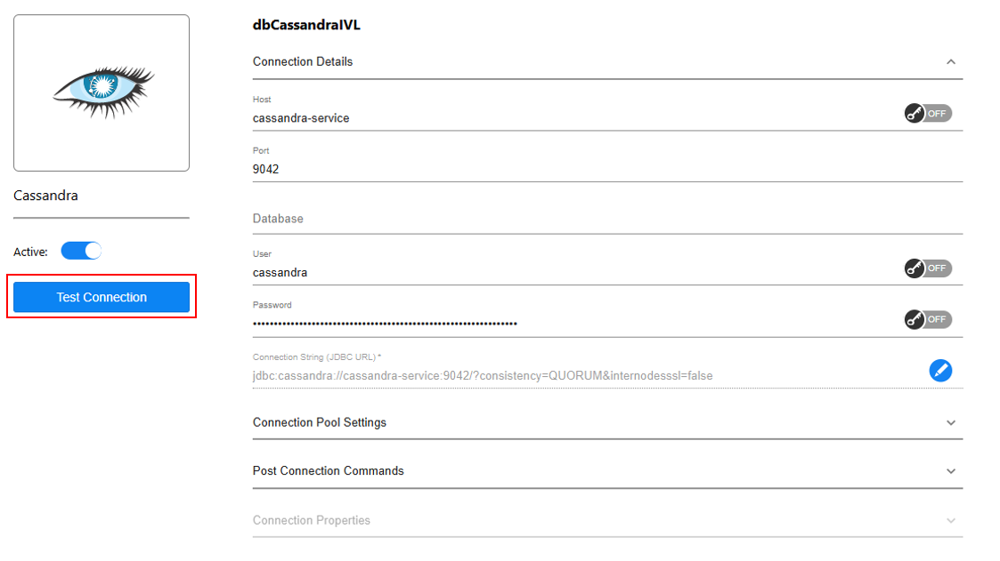

# IVL-README
# Table of Contents 

[Description](#description)

- [Investigator Categories](#investigator-categories)

[Installation](#installation)

- [Requirements](#requirements)

- [Step 1: Download the Investigator Library
](#step-1-download-the-investigator-library)

- [Step 2: Validate Library Components](#step-2-validate-library-components)

- [Step 4: Configure And Validate Interfaces](#step-4-configure-and-validate-interfaces)

- [Step 5: Integrate IID Consumer into Cloud Space](#step-5-integrate-iid-consumer-into-cloud-space)

- [Step 6: Deploy Added/Updated Logical Units](#step-6-deploy-addedupdated-logical-units)

[How To Use](#how-to-use)

- [*IID Search page*](#iid-search-page)

- [*Kafka Topics page*](#kafka-topics-page)

- [*IID Consumer page*](#iid-consumer-page)

# 

# Description

The **Investigator Library** is a Fabric-based application designed to
streamline investigations and enhance efficiency. It analyzes data from
Logical Unit Instances (LUIs), Kafka topics, and monitors active
consumers, providing real-time and summary data on the **Investigator
Web Page**.

## Investigator Categories

The library includes three primary categories:

1.  **IID Search**

    Used for instance-specific investigations.

    > Mandatory inputs:

    - LU Type

    - IID

    > Optional inputs:

    - Sub categories- check box with 4 options: System DB, LUi Data, Delta
    Topics, Log

    <table>
    <colgroup>
    <col style="width: 17%" />
    <col style="width: 82%" />
    </colgroup>
    <thead>
    <tr>
    <th>Tab</th>
    <th>Description</th>
    </tr>
    </thead>
    <tbody>
    <tr>
    <th>System DB</th>
    <td>
Displays instance data from the System DB.

    <ol type="1">
    <li>
Entity info
</li>
    <li>
Batch info
</li>
    <li>
Stats info
</li>
    <li>
IIDFinder staging info
</li>
    </ol></td>
    </tr>
    <tr>
    <th>LUi Data</th>
    <td>Displays all the instance table data stored in Fabric.</td>
    </tr>
    <tr>
    <th>Delta Topics</th>
    <td>Displays delta messages for this instance in the LU delta
    topic.</td>
    </tr>
    <tr>
    <th>Log</th>
    <td>Displays K2Fabric log messages for GET executions of the selected
    instance within a specified time range.</td>
    </tr>
    </tbody>
    </table>

2.  **Kafka Topics**

    Supports Kafka/IDFinder-related investigations.

    <table>
    <colgroup>
    <col style="width: 17%" />
    <col style="width: 82%" />
    </colgroup>
    <thead>
    <tr>
    <th>Tab</th>
    <th>Description</th>
    </tr>
    </thead>
    <tbody>
    <tr>
    <th>Messages</th>
    <td>
Displays Kafka topic data based on user inputs.

    
Mandatory Inputs:

    
Search Type (Delta/IIDFinder)

    
Topic

    
Advanced/Optional Inputs:

    <ol type="1">
    <li>
Partition (Specify the topic partition, default is to fetch from
    all partitions)
</li>
    <li>
Offset (Specify the message offset, default is from
    beginning)
</li>
    <li>
Limit (Set the maximum number of returned messages; default is
    <strong>1000</strong>, adjustable within the range <strong>[1,
    10,000]</strong>)
</li>
    <li>
Regex (filters messages containing given value)
</li>
    <li>
Operation Type (Kafka message operation
    type-insert/update/delete)
</li>
    <li>
Date Range (Time range of the messages to be displayed)
</li>
    </ol>
    
Based on these inputs, the library searches and analyzes messages
    from the Kafka topics, utilizing the specified filtering
    parameters.
</td>
    </tr>
    <tr>
    <th>Lag</th>
    <td>
Displays Kafka topics lag data based on user inputs.

    
Mandatory Inputs:

    <ol type="1">
    <li>
Search Type (Delta/IIDFinder)
</li>
    </ol>
    
Advanced/Optional Inputs:

    <ol start="2" type="1">
    <li>
Topic
</li>
    </ol>
    
Output:

    <ul>
    <li>
No topic name is provided:
</li>
    </ul>
    <ol type="1">
    <li>
Total group lag across all topics.
</li>
    <li>
Lag for each topic in the group.
</li>
    <li>
An option to expand and view topic details by clicking
    <strong>"Show Details"</strong>.
</li>
    </ol>
    <ul>
    <li>
Topic name provided:
</li>
    </ul>
    <ol type="1">
    <li>
Total Lag for chosen topic
</li>
    <li>
Lag per Partition
</li>
    <li>
CurrOffset (Current Offset) per Partition
</li>
    <li>
EndOffset (End Offset) per Partition
</li>
    </ol></td>
    </tr>
    </tbody>
    </table>

3.  **IID Consumer**

    Tracks and summarizes consumer activity defined in the **mtLUTopic**
    MTable**.**

    <table>
    <colgroup>
    <col style="width: 17%" />
    <col style="width: 82%" />
    </colgroup>
    <thead>
    <tr>
    <th>Tab</th>
    <th>Description</th>
    </tr>
    </thead>
    <tbody>
    <tr>
    <th>Summary</th>
    <td>
Provides overall statistics for each subscribed topic by the IID
    Consumers.

    
Mandatory inputs:

    <ol type="1">
    <li>
LU Type – The Logical Unit of the IID Consumer for which
    statistics are displayed.
</li>
    <li>
Time Window – The time range for collecting statistics (default:
    60 minutes).
</li>
    </ol>
    
The main table output presents a Kafka summary for each topic.

    
Output:

    
Lu type

    
Topic

    
Group

    
Partition count

    
Lag- topic’s lag

    
Max partition backlog – partition with largest lag (for partition 0
    with lag of 20: 0(20))

    
Total count – the number of consumed messages

    
Failure count – the number of failed messages

    
An option to expand and view topic details by clicking <strong>"Show
    Details"</strong>.

    
<strong>"Show Details"</strong> reveals a detailed breakdown of the
    partition data for the corresponding topic:

    <ol type="1">
    <li>
Partition – Topic's partition
</li>
    <li>
Lag – Partition's lag
</li>
    <li>
Node id – the node on which the partition's consumer job
    ran
</li>
    <li>
Job uid – the uid of the consumer job
</li>
    <li>
Total count – the number of consumed messages
</li>
    <li>
Failure count – the number of failed messages
</li>
    </ol></td>
    </tr>
    <tr>
    <th>Current</th>
    <td>
Displays real-time data on all actively consumed messages from
    running consumers listed in the <strong>MTable</strong>.

    
The following details are provided:

    <ol type="1">
    <li>
LU Type – Logical Unit associated with the consumer
</li>
    <li>
IID – Instance ID extracted from the currently processed
    message
</li>
    <li>
Topic – Kafka topic from which the consumer is retrieving
    messages
</li>
    <li>
Partition – Partition of the topic being consumed
</li>
    <li>
Offset – Offset of the message within the Kafka topic
</li>
    <li>
Status – Current processing state (SYNC_IN_PROCESS /
    PROCESSING_MESSAGE)
</li>
    <li>
Duration – Time elapsed during message processing
</li>
    <li>
Start Time – Timestamp indicating when message processing
    began
</li>
    <li>
Job Name – Name of the consumer job
</li>
    <li>
Node – Node where the consumer job is running
</li>
    </ol>
    
<strong>Auto Refresh Feature:</strong>

    <ul>
    <li>
When enabled, the table refreshes every 5 seconds, ensuring
    real-time monitoring of active consumers.
</li>
    </ul></td>
    </tr>
    <tr>
    <th>History</th>
    <td>
Provides a comprehensive record of IID consumer statistics,
    allowing users to review past message processing details.

    
Mandatory Inputs:

    <ol type="1">
    <li>
LU Type – The Logical Unit where the consumer exists
</li>
    <li>
Topic – The Kafka topic from which the consumer retrieves
    messages
</li>
    <li>
Start Time – The start time for data retrieval
</li>
    </ol>
    
Advanced/Optional Inputs:

    <ol type="1">
    <li>
End Time – The end time for the historical data
    retrieval
</li>
    <li>
Partition – The Kafka topic partition
</li>
    </ol>
    
Additional filtering can be added through search on the entire table
    or by column.

    
The table includes the following information:

    <ol type="1">
    <li>
IID – Instance ID
</li>
    <li>
Start Time – Timestamp indicating when message process
    started
</li>
    <li>
End Time – Timestamp indicating when message process
    ended
</li>
    <li>
Status – Message state (PROCCESSED/SKIPPED/FAILED)
</li>
    <li>
Process Duration – Time elapsed during process
</li>
    <li>
Sync Duration – Time elapsed during sync
</li>
    <li>
Partition – Topic's partition
</li>
    <li>
Node ID – The node on which the partition's consumer job
    ran
</li>
    <li>
UID – The UID of the consumer job
</li>
    <li>
Offset – Offset of the message within the Kafka topic
</li>
    <li>
Error – Error message (if applicable, for failed
    processes)
</li>
    <li>
Topic – Kafka topic from which the consumer is retrieving
    messages
</li>
    </ol>
    
Limitations:

    
-Time window is restricted to <strong>500</strong> hours, if you
    choose a larger time window the massage: “The selected time window
    exceeds the acceptable range” will appear.
</td>
    </tr>
    </tbody>
    </table>

# Installation

## Requirements

- **Fabric Version**: 8.2 or higher

## Step 1: Download the Investigator Library

1.  Click on Extensions GUI on the left side of your studio’s screen:

    

2.  Search for the “Investigator” extension and click Install.

## Step 2: Validate Library Components

The following components will be integrated into your workspace:

1.  Logical Unit: **Investigator**

2.  Interfaces:  
    **a. dbCassandraIVL  
    b. IVL_IIDF_KAFKA  
    c. IVL_DELTA_KAFKA**

3.  JAR file: **json-20231013.jar** under /lib

4.  Logic Folder: **Investigator** under /Web Services:

5.  A new application added to Application window called "Investigator"

## Step 4: Configure And Validate Interfaces

#### **Configure Connection Parameters:**

#### **dbCassandraIVL:**

- Host – Cassandra host of your cloud environment

- Port – Cassandra port of your cloud environnement

- User – Cassandra user credentials

- Password – Cassandra authentication password

> Configure any additional parameters required to establish a connection
> to the Cassandra instance.

2.  **IVL_IIDF_KAFKA:**

- **Bootstrap Servers**: IDFinder Kafka bootstrap server

- **Group ID**: Investigator

- **Data Type**: String

> Configure any additional parameters required to establish a connection
> to the IDFinder Kafka instance.

3.  **IVL_DELTA_KAFKA:**

- **Bootstrap Servers**: Internal Kafka bootstrap server

- **Group ID**: Investigator

- **Data Type**: Long

> Configure any additional parameters required to establish a connection
> to the Internal Kafka instance.

### ***Validate Interfaces Connectivity:***

In the interface, click **Test Connection** to ensure the connection is
functioning as expected.

Testing the connection verifies the connectivity between Fabric and the
Cassandra\\ KAFKA services, ensuring successful integration.

## 

## Step 5: Integrate IID Consumer into Cloud Space

#### **Configure the Investigator IID Consumer MTable:**

1.  Edit mtLUTopic Mtable:

    1.  Navigate to the MTable Folder within the Investigator LU

    2.  Open mtLUTopic.csv
    
    

3.  For each IID Consumer in your project, add a row in the MTable with
    the following details:

    1.  LU_TYPE – The Logical Unit where the consumer exists

    2.  INTERFACE_NAME – The Kafka interface used to fetch Kafka
        consumer details

    3.  TOPIC_NAME – The Kafka topic the consumer subscribes to

    4.  GROUP_NAME – The Kafka consumer group

    5.  JOB_NAME – The consumer job name, formatted as LuName.JobName

    6.  DESCRIPTION – A brief description of the consumer job

    

#### **Integrate Consumer Stats Write Actors in the Broadway Consumer:**

The Investigator Library includes two key actors responsible for writing
statistics related to the **IID Consumer**. These actors must be
integrated into consumer jobs at various stages to track the consumption
progress. For example, they should be added at **message handling
start**, **GET execution**, and **processing completion**.

1.  **ivlConsumerCurrentStatsWrite**

    This actor is used for the **"Current"** tab on the IID Consumer page.
    It records real-time statistics of messages being processed by the IID
    Consumer at different stages of consumption.

    **Required Inputs for Each Stage:**

    - **lutype** – Logical Unit type of the consumer

    <!-- -->

    - **topic** – Kafka topic the consumer is consuming from

    - **partition** – The partition of the Kafka topic that the consumer
    subscribes to

    - **node** – The node on which the consumer job is running

    - **jobname** – The name of the consumer job

    - **IID** – The Instance ID of the processing message

    - **startTime** – The timestamp when message processing started

    - **status** – The status of the message handling (e.g., SYNC_IN_PROCESS
    / PROCESSING_MESSAGE)

    - **offset** – The offset of the message in the Kafka topic

2.  **ivlConsumerStatsWrite**

    This actor is used for the **"Summary/History"** tab on the IID Consumer
    page. It records statistics of messages that have been processed by the
    IID Consumer at different stages of consumption.

    **Required Inputs for Each Stage:**

    - **iid** – Instance ID of the processed message

    <!-- -->

    - **uid** – UID of the consumer job

    - **start_time** – Timestamp when message processing started

    - **end_time** – Timestamp when message processing ended

    - **process_duration** – Time taken to process the message

    - **status** – Processing status (e.g., PROCESSED, SKIPPED, FAILED,
    COMPLETED)

    - **error** – Error message (if any) encountered during processing

    - **offset** – Offset of the message in the Kafka topic

    - **partition** – The partition of the Kafka topic that the consumer
    subscribes to

    - **sync_duration** – Time taken to synchronize and handle the message

    - **topic** – Kafka topic the consumer is consuming from

    - **time_window** – The time range for processing messages. Format time
    to: yyyyMMddHH

    - **group_id** – Identifier for the Kafka consumer group.

    - **node_id** – The node on which the consumer job was executed.

    > This integration ensures that all consumer activities are logged,
    > allowing the Investigator Library to effectively track and monitor
    > consumers through the IID Consumer page.

    **Note:**

    > In the IIDFinder Library, these actors are already integrated into the
    > Delta Consumer. Therefore, if the IIDFinder Library is installed in
    > your cloud space, they should be removed from the IVL Library to
    > prevent duplication.

#### **Consumer Stats Globals:**

- IVL_SKIPPED_IIDS_STATS: If set to true, logs of skipped IIDs
  gets are recorded in the IID Consumer detailed_stats table.

- IVL_STATS_ACTIVE: If set to true, IID Consumer stats are
  logged to the detailed_stats table and current stats MTable.

## Step 6: Deploy Added/Updated Logical Units

1.  Deploy **Investigator** LU

    > After Deployment, Validate the following Cassandra tables are created
    under **k2system** keyspace:

1.  **get_details**

2.  **log_scan**

3.  **ivl\_\${luname}\_cons_detailed_stat**

<!-- -->

2.  Deploy **Web Services**

# How To Use

***Open Investigator in the Web Framework***

1.  In your Cloud Studio, Click menu at the top left of the screen
    (hamburger icon) and select **Investigator** to open the page.

    

2.  Notice three investigation categories

    1.  IID Search

    2.  Kafka Topics

    3.  IID Consumer

## ***IID Search page***

1. Enter the **LU Type** and **IID**

    

2.  Select desired categories.

3.  Click **Search**.

4.  Sub-tabs will appear in the search results.

    

5.  Explore **System DB** tab

    1.  Click on System DB tab
    2.  Data from various table in the System DB will be displayed on the screen.

        

    3.  The data for the iidFinder cache k/d tables will not be
        displayed automatically due to its large size. To access this
        data, click the triangle icon to expand the cache tables.

        

6.  Explore **Lui Data** tab

    1.  Click on LUi Data tab
    2.  Data from various table in the LU will be displayed on the screen
        

7.  Explore **Delta Topics** tab

    1.  Click on Delta Topics tab
    2.  Messages for the specified instance in the Delta topic will be displayed
         
    

8.  Explore **Log** tab

    1.  Click on Log tab

    2.  Select the desired time range, and click **SAVE**.
        
        
        
    3.  Log messages that are related to the GET execution of the specified
    instance will be displayed in a table format. You can download the
    provided log by clicking the following
    button:
        

<!-- -->

9.  If needed, minimize or remove tables by clicking the **"-"** or
    **"x"** buttons.

## ***Kafka Topics page***

1. In this page, navigate through the tabs using navigator table at the top of the page:

    

2. Explore **Messages** page

    1.  Navigate to **Messages** tab

    2.  Insert the mandatory inputs: **Search Type** and **Topic**

    3.  Insert optional inputs for enhanced search

    4.  Click **Search**
    
        

    5.  Hover over a specific message row to expand and view the full
        message data

3. Explore **Lag** page

    1.  Navigate to **Lag** tab

    2.  Insert the mandatory input: **Search Type**

    3.  Click **Search**

        

## ***IID Consumer page***

1. In this page, navigate through the tabs using navigator table at the top of the page:
    
    

2.  Explore **Summary** page

    1.  Navigate to **Summary** tab

    2.  Insert the mandatory inputs: **LU Type**

    3.  Edit the **Time-Window** input as need

    4.  Click the **Refresh** button

    5.  Summary data of each IID Consumer defined in the mtLUTopic is
        Displayed in the screen

    6.  Expand the data of a specific consumer by clicking on the "Show
        Details" button
        
        

3.  Explore **Current** Page

    1.  Navigate to **Current** tab

    2.  The currently running GET executions from the predefined IID
        Consumers are displayed on the screen

        

4.  Explore **History** Page

    1.  Navigate to **History** tab

    2.  Insert the mandatory inputs: **LU Type**, **Topic**, **Start
        Time**

    3.  Click **Seach**

    4.  History data of each GET execution executed by the predefined
        IID Consumers is displayed on the screen

    5.  To log SKIPPED messages, change the global:
        IVL_SKIPPED_IIDS_STATS
        
        

***Notes:***

1.  Table columns are adjustable (reorder, resize).

2.  Hover over long text rows to expand and view full content.
